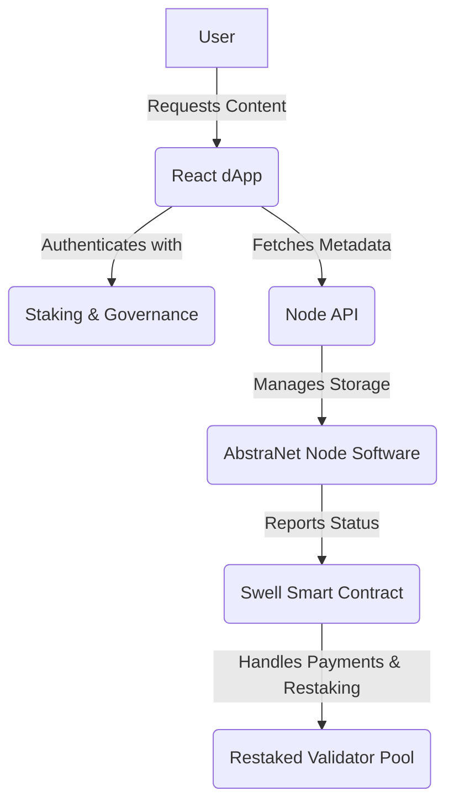

---

# **AbstraNet**  
_A Restaking-Powered Decentralized Content Delivery Network on Swellchain_  

### **Revolutionizing Web3 Content Delivery with Restaking, Security & Decentralization**  

  
  
  

---

## 📖 **Overview**  
AbstraNet is a **restaking-powered decentralized content delivery network (dCDN)** built on **Swellchain**. It enables **validators, node operators, and stakers** to monetize their **bandwidth, compute power, and storage** while ensuring **high-performance, censorship-resistant content delivery**.  

✅ **Restaking-powered validator incentives**  
✅ **Decentralized storage with IPFS integration**  
✅ **High-speed, censorship-resistant content delivery**  
✅ **Smart contract-powered payments & governance**  
✅ **Earn rewards through Swellchain’s staking model**  

---

## 🛠️ **Core Features**  
### 🔹 **Restaking-Powered Nodes**  
- Operators **stake SWELL/swETH** to participate in content delivery.  
- Validators earn additional yield through **content distribution incentives**.  

### 🔹 **Decentralized Storage (IPFS Integration)**  
- Files are **split into chunks** and stored across **restaked nodes**.  
- Uses **IPFS** for **secure, censorship-resistant content distribution**.  

### 🔹 **Smart Contract Governance & Payments**  
- Tracks **node participation & content verification**.  
- Automates **payments & stake reallocation** via **Swell-powered staking models**.  

### 🔹 **DeFi & AI Integrations**  
- Supports **Swell-powered lending & staking derivatives**.  
- AI workloads distributed across **restaked nodes** for decentralized compute power.  

---

## 📐 **Architecture**  

### 🏗 **Tech Stack**  
| Layer      | Tech Used |
|------------|----------|
| **Frontend** | React + Swellchain SDK |
| **Backend** | Django + PostgreSQL |
| **Blockchain** | Swellchain Smart Contracts |
| **Storage** | IPFS + AbstraNet Node Software |

---

## 💰 **Node Operator & Validator Earnings**  
🔹 **Earn SWELL tokens** by **storing data & serving content**  
🔹 **Staking validators earn additional rewards** via **Proof of Restake**  
🔹 **Payments & rewards automated** through **Swellchain smart contracts**  

---

## 📜 **Smart Contracts Used**  
| Contract | Purpose |
|----------|---------|
| **Storage & Retrieval Contract** | Tracks file chunks, verifies integrity, and rewards nodes. |
| **Content Payment Contract** | Handles micropayments for file access and delivery. |
| **Restaking & Validator Pool Contract** | Manages staked assets, validator tracking, and yield generation. |

---

## 🚀 **Roadmap**  
✅ **Phase 1: Testnet Deployment** (Current)  
⏳ **Phase 2: Mainnet Launch & Validator Incentives**  
🔜 **Phase 3: AI Compute, DeFi Lending & Advanced Staking**  

---

## 🤝 **Contributing**  
We welcome contributors!  
1. **Fork the repo**  
2. **Create a branch** (`git checkout -b feature-name`)  
3. **Commit changes** (`git commit -m "Added feature"`)  
4. **Push to GitHub** (`git push origin feature-name`)  
5. **Submit a pull request**  

---

## 🔗 **Connect With Us**  
📩 Email: [dev](mailto:toogun.io@gmail.com)  
🐦 X: [@mtcxdev](https://x.com/mtcxdev)  
💼 LinkedIn: [MTCX - Dev](https://www.linkedin.com/in/oluwaseyi-oluwatoogun-65402b2b7)  

📜 **License**: [MIT](LICENSE)  

---

