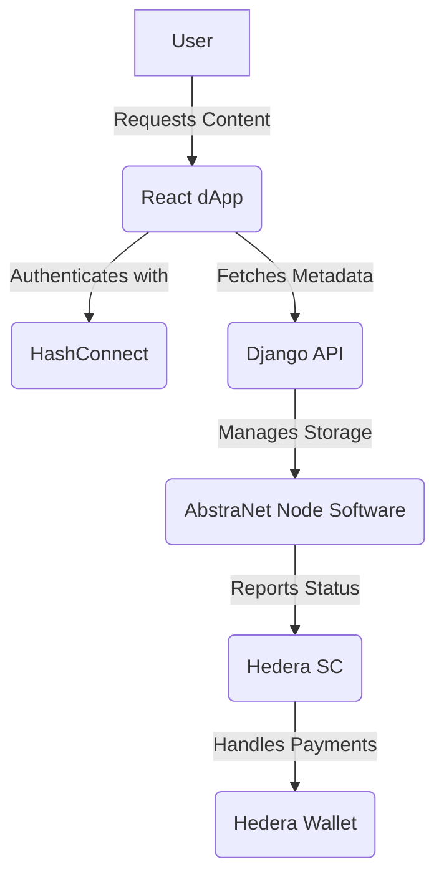

 ---

# **AbstraNet**  
_A Decentralized Content Delivery Network on Hedera_  

  

### **Revolutionizing Web3 Content Delivery with Decentralization, Security & Speed**  

[](https://hedera.com)  
[](LICENSE)  
[](https://github.com/mtcxdev/AbstraNet/graphs/contributors)  

---

## 📖 **Overview**  
AbstraNet is a **decentralized content delivery network (dCDN)** built on **Hedera Hashgraph**. It empowers **individuals, dApps, and enterprises** with:  

✅ **Low-latency content delivery**  
✅ **Zero-knowledge proof security**  
✅ **Censorship resistance**  
✅ **Decentralized storage & file chunking**  
✅ **Income opportunities for node operators**  

---

## 🛠️ **Core Features**  
### 🔹 **Decentralized Storage**  
- Files are **split into chunks** and stored across independent nodes.  
- Nodes **earn rewards** for providing storage.  

### 🔹 **Smart Contract Integration**  
- Tracks **chunk locations & verification**.  
- Automates **payments** for storage & retrieval.  

### 🔹 **Node Participation & Rewards**  
- Anyone can **host a node** and monetize **unused bandwidth & storage**.  
- Nodes **must stay online** to earn rewards.  

### 🔹 **Web3 & Hedera Integration**  
- Built on **Hedera Hashgraph** for **low fees & high throughput**.  
- Uses **HashConnect** for secure **wallet authentication & transactions**.  

---

## 📐 **Architecture**  


### 🏗 **Tech Stack**  
| Layer      | Tech Used |
|------------|----------|
| **Frontend** | React + HashConnect |
| **Backend** | Django + PostgreSQL |
| **Blockchain** | Hedera Smart Contracts |
| **Storage** | AbstraNet Node Software |

---

## 📥 **Getting Started**  

### 🔹 **1. Clone the Repository**  
```sh
git clone https://github.com/AbstraNet/AbstraNet.git
cd AbstraNet
```

### 🔹 **2. Install Dependencies**  
#### 📌 Backend (Django)  
```sh
cd backend
pip install -r requirements.txt
python manage.py migrate
python manage.py runserver
```
#### 📌 Frontend (React)  
```sh
cd frontend
npm install
npm run dev
```
#### 📌 Node Software  
```sh
cd node
npm install
node index.js
```

### 🔹 **3. Deploy Smart Contracts (Hedera Testnet)**  
```sh
npx hardhat run scripts/deploy.js --network testnet
```

---

## 💰 **Node Operator Earnings**  
🔹 **Earn HBAR tokens** by **storing chunks & serving content**  
🔹 **Payments are automated** using **Hedera smart contracts**  
🔹 **Node uptime is tracked** to prevent fraud  

---

## 📜 **Smart Contracts Used**  
| Contract | Purpose |
|----------|---------|
| **Storage & Retrieval Contract** | Tracks file chunks, verifies integrity, and rewards nodes. |
| **Content Payment Contract** | Handles micropayments for file access and delivery. |

---

## 🚀 **Roadmap**  
✅ **Phase 1: Testnet Deployment** (Current)  
⏳ **Phase 2: Mainnet Launch & Governance**  
🔜 **Phase 3: Scaling & AI Optimizations**  

---

## 🤝 **Contributing**  
We welcome contributors!  
1. **Fork the repo**  
2. **Create a branch** (`git checkout -b feature-name`)  
3. **Commit changes** (`git commit -m "Added feature"`)  
4. **Push to GitHub** (`git push origin feature-name`)  
5. **Submit a pull request**  

---

## 🔗 **Connect With Us**  
📩 Email: [dev](mailto:toogun.io@gmail.com)  
🐦 X: [@mtcxdev](https://x.com/mtcxdev)  
💼 LinkedIn: [MTCX - Dev](https://www.linkedin.com/in/oluwaseyi-oluwatoogun-65402b2b7)  

📜 **License**: [MIT](LICENSE)  

---
